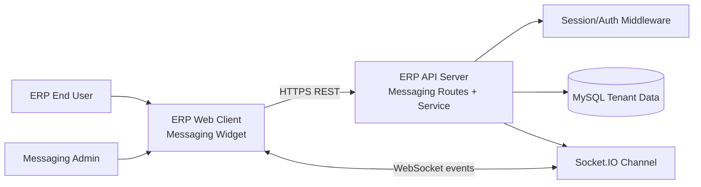
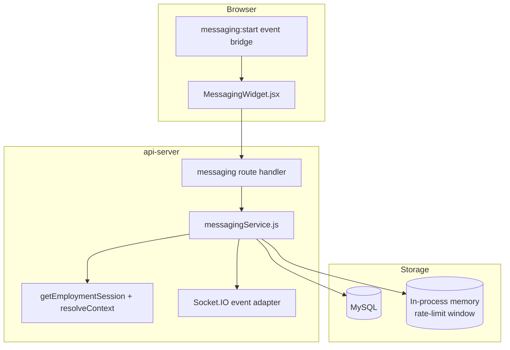
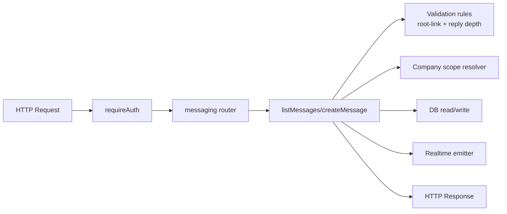
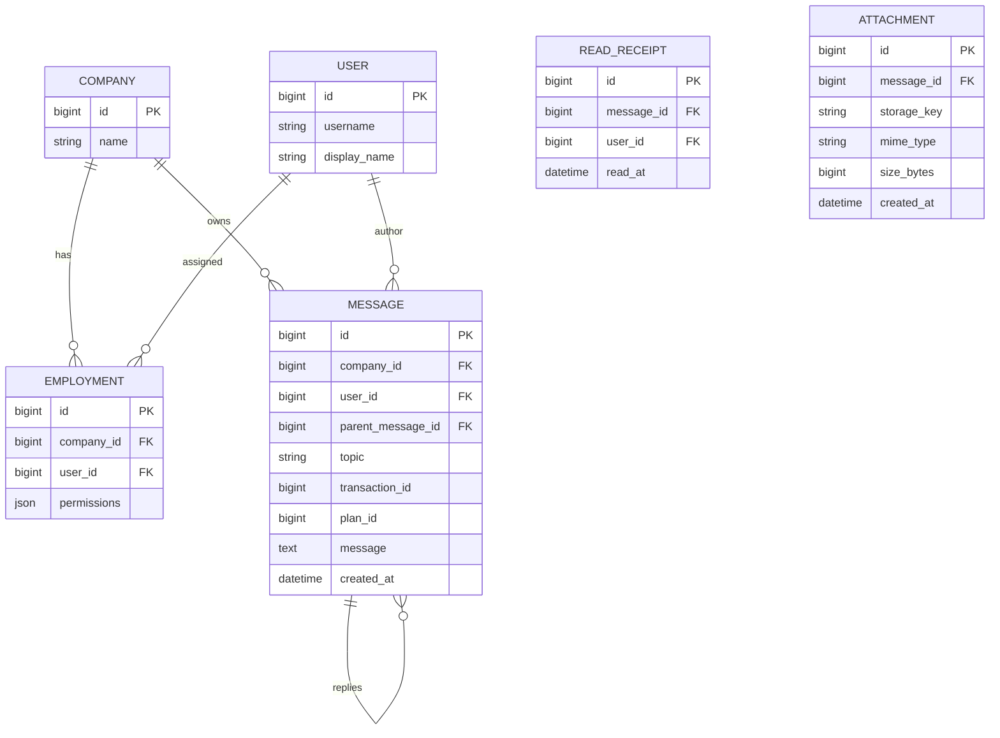

# Messaging Architecture & Design Artifacts

This document closes the architecture/design documentation gap for the messaging module and provides the baseline artifacts requested by `docs/secure-messaging-prompt-pack.md`.

## 1. C4-lite Architecture

### 1.1 System context (C4 level 1)

**Responsibilities**
- **ERP Web Client**: renders the collapsible widget, loads scoped messages, and publishes user actions.
- **API Server**: enforces authentication, company scoping, root-link validation, reply depth limits, and anti-spam limits.
- **MySQL Tenant Data**: stores message threads, users, and company context used for authorization checks.
- **Socket.IO**: pushes new message and presence updates to clients in near-real time.

### 1.2 Container view (C4 level 2)

### 1.3 Component view (C4 level 3 for messaging)

---

## 2. Data Model ERD (current + target additions)

### ERD rationale
- `MESSAGE.company_id` is the primary tenant isolation key and must always be present.
- `parent_message_id` enables adjacency-list thread traversal with bounded depth checks in service logic.
- Exactly one top-level link (`topic | transaction_id | plan_id`) is enforced today in service-layer validation; migration track should add DB constraints when schema governance allows.
- `READ_RECEIPT` and `ATTACHMENT` are modeled as target entities for next schema phase; they are included here to prevent design drift.

---

## 3. STRIDE Threat Model (messaging-specific)

| STRIDE category | Primary threat | Impact | Mitigations in place | Planned hardening |
|---|---|---|---|---|
| Spoofing | Forged identity via unauthenticated API/WebSocket usage | Unauthorized read/write | `requireAuth` for API + session-bound context checks | Token binding for websocket handshake and periodic session revalidation |
| Tampering | Message content or parent/thread links altered outside authorization path | Data integrity loss | Service-layer validation for root-link and reply depth | Signed audit trail for edits/deletes; immutable event log |
| Repudiation | User denies sending abusive message | Incident investigation friction | Message rows include author + timestamp metadata | Append-only moderation/audit stream with correlation IDs |
| Information Disclosure | Cross-company leakage (IDOR/BOLA) | Tenant data breach | `resolveContext()` + employment-based scoping per request | Automated IDOR tests + DB-level tenant constraint checks |
| Denial of Service | Flooding message create endpoint | Service degradation | In-memory rate limit and duplicate suppression | Distributed limiter (Redis) + adaptive abuse controls |
| Elevation of Privilege | Low-privilege user performs moderation actions | Unauthorized operations | Permission checks via session permissions | Formal RBAC/ABAC policy matrix with deny-overrides |

### Residual risks
- In-memory anti-spam controls do not protect multi-instance deployments.
- DB-level tenant and link constraints are not yet fully encoded.
- Moderation/audit evidencing is functional but not tamper-evident.

---

## 4. SLOs, Performance Targets, and Capacity Assumptions

### 4.1 SLO table

| Objective | SLI | Target | Measurement window |
|---|---|---|---|
| Message read latency | P95 `GET /api/messaging` response time | <= 300 ms | 28-day rolling |
| Message write latency | P95 `POST /api/messaging` response time | <= 400 ms | 28-day rolling |
| Realtime fanout delay | P95 time from accepted write to socket event delivery | <= 1.5 s | 28-day rolling |
| Availability | Successful API requests / total API requests | >= 99.9% | Monthly |
| Correct tenant scoping | Cross-tenant leak incidents | 0 accepted leaks | Monthly |

### 4.2 Capacity assumptions
- **Active users**: 2,000 daily active users across all tenants.
- **Concurrent users**: 300 steady-state, 800 short peaks.
- **Write burst**: up to 120 message writes/minute during operational peaks.
- **Read/write ratio**: ~8:1 (thread refreshes dominate).
- **Average payload size**: <= 2 KB per message body (attachments are out-of-band in future phase).

### 4.3 Scaling notes
- Current architecture is acceptable for single-node and low multi-node workloads.
- For multi-node scale, move rate limiting and presence state to shared infrastructure (Redis), and partition socket fanout by company.

---

## 5. Migration Strategy, Rollback Plan, and Decision Log

### 5.1 Migration strategy (empty state to production)
1. **Phase A – Baseline schema verification**: ensure messaging tables and required indexes exist in all tenant environments.
2. **Phase B – Guardrail release**: deploy validation logic first (root-link, depth, context checks) with read-only observability toggles.
3. **Phase C – Realtime rollout**: enable socket fanout by company with per-tenant feature flag.
4. **Phase D – Hardening schema**: add DB constraints (single-root-link check, foreign key enforcement improvements), then backfill/repair outliers before enforcing `NOT VALID` -> validated constraints.
5. **Phase E – Extended entities**: introduce `read_receipts`, `attachments`, and queue-backed moderation/notifications.

### 5.2 Rollback strategy
- **Application rollback**: revert to previous API build; messaging rows are backward-compatible if new columns are additive.
- **Schema rollback**: for non-destructive changes, disable feature flags and keep schema forward while app reverts.
- **Constraint rollback**: if constraint activation causes production write failures, mark constraint as not enforced (or drop), replay failed writes after data repair.
- **Realtime rollback**: disable socket emission feature flag and continue REST polling fallback in widget.

### 5.3 Decision log

| ID | Date | Decision | Why | Consequence |
|---|---|---|---|---|
| MSG-ADR-001 | 2026-02-11 | Keep adjacency-list replies (`parent_message_id`) | Existing implementation already uses recursive tree rendering and bounded depth checks | Lower migration cost; recursive query optimization remains important |
| MSG-ADR-002 | 2026-02-11 | Keep service-layer root-link validation until DB constraint rollout phase | Prevents blocking current release while schema governance catches up | Requires strict test coverage to avoid drift |
| MSG-ADR-003 | 2026-02-11 | Define SLOs now before adding read receipts/attachments | Establishes measurable baseline for current scope | Future features must re-baseline capacity and error budgets |
| MSG-ADR-004 | 2026-02-11 | Use feature-flagged rollout and forward-compatible schema migrations | Minimizes downtime and enables fast rollback | Requires disciplined flag lifecycle management |

---

## 6. Traceability to Prompt-Pack Requirements

This document covers the following required artifacts from `docs/secure-messaging-prompt-pack.md` section 1:
- C4-lite architecture (context/container/component)
- Data model ERD and rationale
- STRIDE threat model with mitigations and residual risks
- SLO/performance/capacity assumptions
- Migration strategy with rollback plan and decision log
