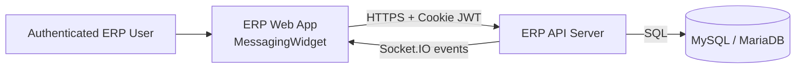
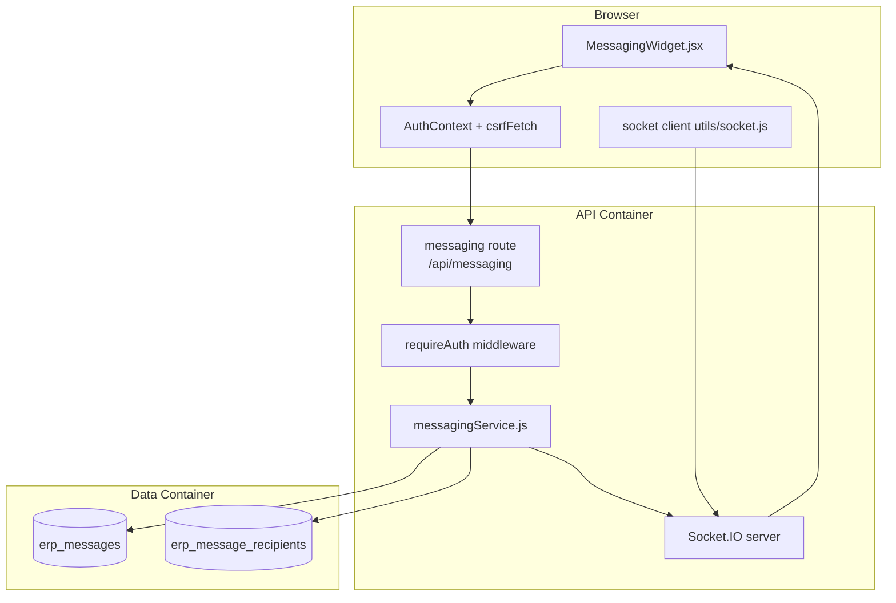
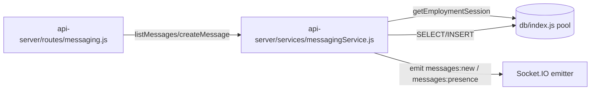

# Secure Messaging C4-Lite Architecture

## Scope
This C4-lite view covers the currently implemented secure messaging flow (`GET /api/messaging`, `POST /api/messaging`, Socket.IO events, and widget rendering).

## Level 1 — System Context

### External actors
- **Authenticated ERP User**: Sends and reads messages from within ERP screens.

### System boundary
- **ERP Web App + API server** host messaging UI, API endpoints, and realtime events.

---

## Level 2 — Container View

### Container responsibilities
- **MessagingWidget (frontend)**: Displays thread tree, dispatches fetch/post calls, subscribes to `messages:new` and `messages:presence`.
- **Messaging route/service (backend)**: Authenticates, enforces company scoping + root-link/depth/rate constraints, persists/retrieves messages.
- **Socket.IO server**: Broadcasts new messages and presence updates to `company:<companyId>` rooms.
- **MySQL tables**: Store message rows and optional recipient rows.

---

## Level 3 — Component View (API container)

### Key component interactions
1. `requireAuth` resolves authenticated user context before route handlers run.
2. `listMessages`/`createMessage` call `resolveContext` and `getEmploymentSession` to scope to company.
3. `createMessage` validates root-link cardinality, depth limit, and in-memory anti-spam constraints.
4. On insert, service emits `messages:new` to the company room.
5. Socket lifecycle calls `markOnline`/`markOffline` to publish `messages:presence`.

## Design notes
- Current architecture is **single API container + in-memory anti-spam/presence**; no Redis/distributed coordination yet.
- Schema initialization is done lazily in app code (`ensureSchema`) rather than dedicated migration tooling.
