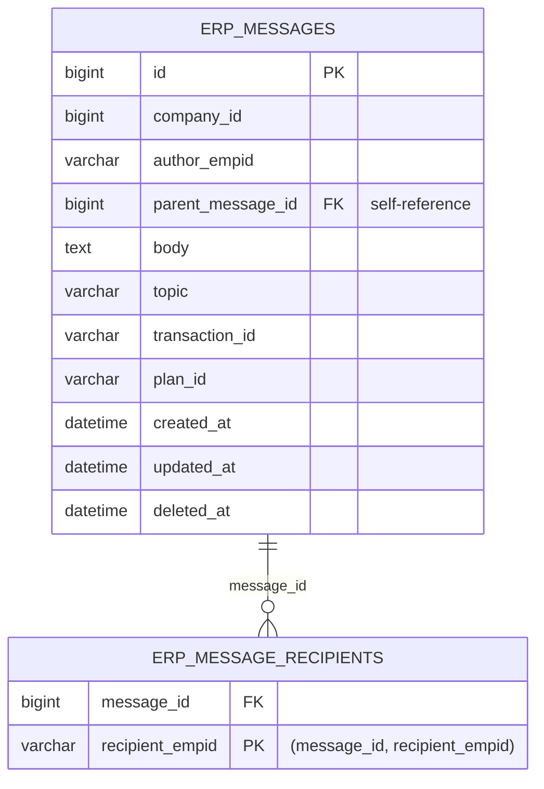

# Secure Messaging ERD (Current State)

## Logical entities

## Relationship and constraints
- `erp_messages.id` is the primary key.
- `erp_messages.parent_message_id` creates a thread tree by self-reference (validated in application logic).
- `erp_message_recipients.message_id` references `erp_messages.id` with `ON DELETE CASCADE`.
- Recipient rows are optional; absence means broad company visibility (subject to application filters).

## Current indexing
- `erp_messages`: `(company_id, created_at)`, `parent_message_id`, `author_empid`.
- `erp_message_recipients`: `(message_id, recipient_empid)` PK and `recipient_empid` secondary index.

## Known model gaps (tracked)
- No DB-level check for exactly one root-link (`topic | transaction_id | plan_id`) on root messages.
- No DB-level guard for reply-depth maximum.
- No first-class entities yet for read receipts, attachment metadata, moderation actions, or notification queue.
