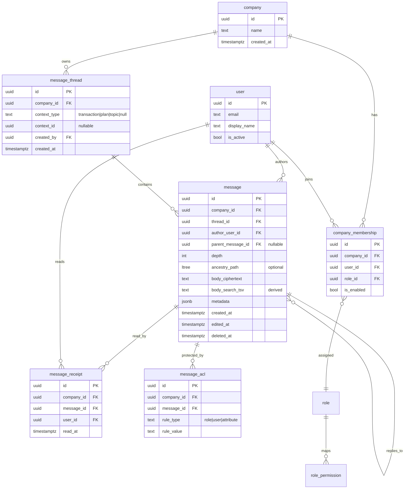

# Secure Messaging System for ERP — Product + Architecture Blueprint

## 1) Scope and Assumptions

- Messaging is embedded into an ERP and available in contextual surfaces (transaction, plan, topic, and general workspace chat).
- Every message belongs to exactly one company and is visible only within that company context.
- A message can optionally link to **one and only one** context target: `transaction`, `plan`, or `topic`.
- Replies are threaded with configurable maximum depth (`MAX_THREAD_DEPTH`, default = 8).
- Transport uses WebSocket for bidirectional, low-latency status and messaging updates; SSE fallback can be enabled for restricted environments.

---

## 2) C4-lite Architecture

## 2.1 Context Diagram (System Context)

**Actors**
- ERP User (employee, manager, auditor, admin)
- ERP Identity Provider (OIDC/SAML)
- Internal Policy Engine (RBAC + optional ABAC checks)

**Primary System**
- ERP Messaging Platform

**External Dependencies**
- PostgreSQL (system of record)
- Redis (presence, pub/sub fanout, rate limit counters, ephemeral idempotency state)
- File/Key Management (KMS-backed encryption keys for sensitive fields)

## 2.2 Container Diagram

1. **Web Client (ERP Frontend Widget)**
   - Collapsible, session-aware, context-sensitive UI
   - Uses REST for CRUD/bootstrap and WebSocket for realtime updates

2. **API Gateway / BFF**
   - Auth token validation, company context enforcement, request shaping
   - Issues short-lived WS auth tickets

3. **Messaging Service**
   - Message/reply creation, thread traversal, authorization filtering
   - Enforces idempotency and anti-spam policies

4. **Presence Service**
   - Tracks user status (online/offline/away)
   - Heartbeat processing, status transitions, and fanout

5. **Policy Service / PDP Hook**
   - RBAC decisions with optional ABAC policy evaluation
   - Context-aware checks for message visibility and posting rights

6. **PostgreSQL**
   - Durable storage for users, memberships, messages, thread edges, receipts
   - Row-level security (RLS) for tenant isolation

7. **Redis**
   - Presence state + heartbeat TTL
   - WS shard pub/sub for realtime fanout
   - Rate limit counters, anti-spam scoring cache, idempotency key cache

## 2.3 Component Diagram (inside Messaging Service)

- **Command API**: create/edit/delete/react/reply endpoints
- **Query API**: thread loading, context feed, unread counters
- **Thread Engine**: validates parent-child depth, computes ancestry path/cached depth
- **Authorization Filter**: request-time and query-time filtering by RBAC/ABAC
- **Context Link Validator**: guarantees exactly one optional link target
- **Event Publisher**: emits `message.created`, `message.updated`, `presence.changed`
- **Audit Logger**: immutable audit trail for moderation/compliance

---

## 3) Data Model (ERD + Rationale)

## 3.1 Core Entities



## 3.2 Key Constraints

- `message_thread` CHECK enforces context shape:
  - both `context_type` and `context_id` null (general chat), or
  - both non-null and `context_type IN ('transaction','plan','topic')`.
- Uniqueness for linked context:
  - `UNIQUE (company_id, context_type, context_id)` to prevent duplicate context threads where desired.
- `message.parent_message_id` references same `thread_id` and same `company_id` (enforced via trigger).
- `message.depth <= MAX_THREAD_DEPTH` enforced at insert/update.
- `message_acl.company_id = message.company_id` enforced with FK composite.

## 3.3 Rationale

- Separate `message_thread` from `message` to support efficient feed retrieval and context lookup.
- Store `company_id` redundantly on key tables for defensive isolation and fast partition/index scans.
- `ancestry_path` (`ltree`) allows efficient subtree queries; depth integer supports quick validation.
- `message_acl` supports fine-grained exceptions without exploding role tables.

---

## 4) API + Realtime Protocol Contracts

## 4.1 REST Endpoints (v1)

- `POST /v1/companies/{companyId}/threads`
  - Creates thread with optional context link
  - Body: `{ contextType?: 'transaction'|'plan'|'topic', contextId?: string }`

- `GET /v1/companies/{companyId}/threads?contextType=&contextId=&cursor=`
  - List threads visible to caller

- `POST /v1/companies/{companyId}/threads/{threadId}/messages`
  - Create top-level message or reply
  - Headers: `Idempotency-Key: <uuid>`
  - Body: `{ body: string, parentMessageId?: string, clientMessageId?: string }`

- `GET /v1/companies/{companyId}/threads/{threadId}/messages?cursor=&limit=`
  - Returns permission-filtered messages (tree or flattened with parent refs)

- `POST /v1/companies/{companyId}/presence/status`
  - Body: `{ status: 'online'|'away'|'offline' }`

- `GET /v1/companies/{companyId}/presence`
  - Current visible presence map

- `POST /v1/companies/{companyId}/messages/{messageId}/read`
  - Mark as read

## 4.2 WebSocket Channels

- Endpoint: `wss://erp.example.com/ws?ticket=<short_lived_ticket>`
- Client subscribe frame:
  ```json
  {"type":"subscribe","companyId":"...","topics":["presence","thread:<id>","context:transaction:<id>"]}
  ```
- Server events:
  - `presence.changed`: `{ userId, status, changedAt }`
  - `message.created`: `{ threadId, message, visibilityHash }`
  - `message.updated`: `{ messageId, editedAt }`
  - `message.deleted`: `{ messageId, deletedAt }`
  - `receipt.updated`: `{ messageId, userId, readAt }`

## 4.3 Delivery Semantics

- At-least-once event delivery via Redis pub/sub + client ack checkpoints.
- Idempotent message creation via `Idempotency-Key` + `(company_id, user_id, key)` uniqueness in DB.
- Server assigns monotonic per-thread sequence for replay windows.

---

## 5) AuthN/AuthZ Model

## 5.1 Authentication

- OIDC access token validated at gateway.
- WS uses short-lived signed ticket minted from authenticated REST session.

## 5.2 Authorization (RBAC + ABAC Hooks)

RBAC base permissions:
- `message:read`, `message:write`, `message:moderate`, `presence:read`, `presence:write`.

ABAC optional hook inputs:
- `company_id`, `user.department`, `resource.context_type`, `resource.context_id`, `resource.sensitivity`, `time_window`.

Decision flow:
1. Verify membership in active company.
2. Check RBAC permission.
3. If policy hook configured, evaluate ABAC predicate.
4. Apply message-level ACL overrides (allow/deny) with deny precedence.

## 5.3 Tenant Isolation + RLS

- Every request sets DB session vars:
  - `app.user_id`
  - `app.company_id`
  - `app.role_set`
- PostgreSQL RLS policies on `message_thread`, `message`, `message_receipt`, `message_acl`:
  - `USING (company_id = current_setting('app.company_id')::uuid)`
  - Additional `EXISTS` clause ensures `company_membership` + enabled state.
- Service-layer guard duplicates checks before query execution.
- No cross-tenant joins without explicit security-definer function reviewed and audited.

---

## 6) Security, Abuse Prevention, and Reliability Controls

## 6.1 Data Security

- Encrypt message body at rest (application-level envelope encryption with KMS-managed DEKs).
- TLS 1.2+ in transit.
- Optional field-level redaction for logs (`body` never logged in plaintext).

## 6.2 Idempotency

- `idempotency_keys` table: `(company_id, user_id, key, request_hash, response_blob, expires_at)`.
- Replay returns prior success payload for same hash; mismatch hash returns `409`.

## 6.3 Rate Limiting + Anti-spam

- Redis token bucket per `(company_id,user_id)` for send actions.
- Burst + sustained limits, e.g., `10 msgs / 10s`, `120 msgs / 10m`.
- Content heuristics: repeated identical bodies, excessive mentions, blocked URL domains.
- Progressive penalties: warn → temporary cooldown → moderator review queue.

## 6.4 Auditing

- Immutable audit events for create/edit/delete/moderate decisions.
- Admin query API for compliance exports, scoped per company.

---

## 7) Threat Model (STRIDE)

| STRIDE | Threat | Mitigations | Residual Risk |
|---|---|---|---|
| Spoofing | Forged WS clients / stolen tokens | Short-lived WS ticket, token binding to session + IP heuristics, re-auth on company switch | Session theft still possible on compromised endpoint |
| Tampering | Message alteration in transit/storage | TLS, signed event envelopes, encrypted-at-rest body + integrity checks | Insider DB superuser risk |
| Repudiation | User denies sending message | Audit log with actor, IP/device, idempotency key linkage, immutable append-only store | Shared accounts reduce attribution quality |
| Information Disclosure | Cross-company data leak | RLS + service checks + scoped caches + encrypted fields | Misconfigured security-definer SQL can bypass RLS |
| Denial of Service | Spam/flood over API/WS | Rate limits, circuit breakers, per-company quotas, WAF | Large distributed botnets can degrade availability |
| Elevation of Privilege | Unauthorized read/write via role bugs | Least privilege RBAC, ABAC policy tests, deny-by-default ACLs | Complex policy interactions may introduce corner cases |

---

## 8) Performance Targets, SLOs, and Capacity

## 8.1 Assumptions

- 5,000 companies, 200,000 total users.
- Peak concurrent WS connections: 25,000.
- Peak write rate: 2,500 messages/sec globally.
- Average message size (plaintext): 500 bytes.

## 8.2 Targets

- `POST message` API P95 < 180 ms, P99 < 350 ms.
- `GET thread messages` P95 < 220 ms for first page (50 items).
- Presence fanout propagation P95 < 2 s.
- WS event delivery success > 99.9% within 5 s.

## 8.3 SLOs

- Monthly availability: 99.95% for read/write APIs.
- Durability: RPO ≤ 5 min, RTO ≤ 30 min.
- Error budget policy tied to feature release freeze thresholds.

## 8.4 Scaling Notes

- Partition `message` by `company_id` hash or by time+company for high scale.
- Redis cluster for pub/sub and counters.
- Read replicas for query-heavy thread fetches (write-after-read consistency via sticky routing when needed).

---

## 9) Migration Strategy (Empty State) + Rollback

## 9.1 Forward Plan

1. Create schema v1 with RLS disabled but policies defined.
2. Seed roles/permissions and baseline company membership mappings.
3. Enable RLS in staged environment; run policy verification tests.
4. Deploy Messaging + Presence services behind feature flag.
5. Enable for internal pilot companies.
6. Gradually expand rollout by company cohorts.

## 9.2 Rollback Plan

- Feature-flag off widget + API routes to stop new writes.
- Keep DB schema; preserve data for re-enable.
- Roll back service binaries independently (blue/green).
- If policy regression occurs, switch to safe mode: deny writes, restrict reads to moderators until fixed.

---

## 10) Decision Log

1. **WebSocket over SSE**: chosen for bidirectional presence + typing/read acknowledgements.
2. **Thread depth cap**: prevents pathological recursion and expensive tree traversals.
3. **RLS mandatory**: defense-in-depth for tenant isolation.
4. **RBAC first, ABAC optional**: simpler baseline with extensibility.
5. **Envelope encryption for body**: protects sensitive communication content.

---

## 11) Open Questions

1. Should message edit history be user-visible or admin-only?
2. Do we need legal hold/retention policies per company jurisdiction?
3. Is cross-company shared service desk messaging ever required (currently disallowed)?
4. Should typing indicators be included (additional presence/event load)?
5. Which contexts require stricter ABAC (e.g., payroll transactions)?

---

## 12) Implementation Checklist (Practical Next Steps)

- Define SQL schema + constraints + RLS policies.
- Implement auth middleware for active company context switching.
- Build message create/query APIs with permission filters.
- Add WS gateway + Redis pub/sub fanout.
- Implement presence heartbeats and away/offline transitions.
- Add anti-spam and moderation queue.
- Add observability dashboards (latency, fanout lag, policy-deny rates).
- Run load tests against P95 targets before GA.
